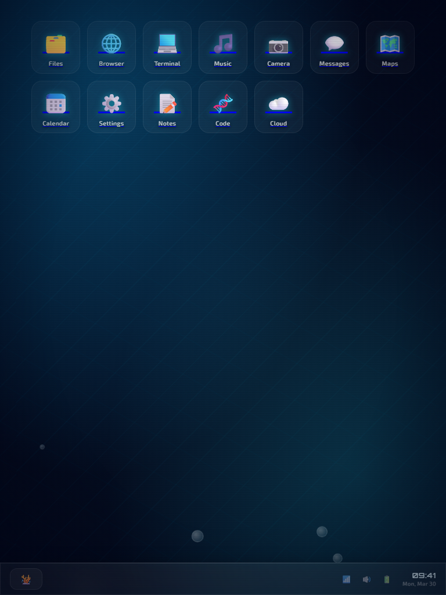
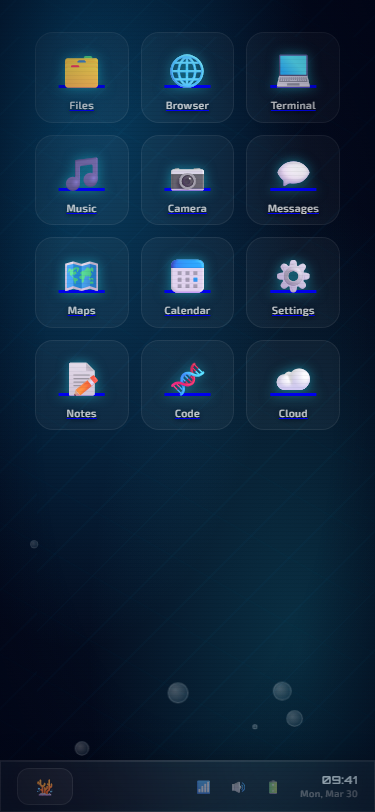

# 🪸 AquaOS

A fully functional desktop OS UI — built with nothing but HTML and CSS.

---

## Try it

**Live:** [poran-dip.github.io/aqua-os](https://poran-dip.github.io/aqua-os/)

**Locally:**
```bash
git clone https://github.com/poran-dip/aqua-os.git
```
Then just open `index.html` in a browser. No server, no installs, no build step — it's literally one HTML file.

## What is this?

AquaOS is a glassmorphic desktop environment inspired by deep ocean aesthetics. Frosted glass, floating bubbles, caustic light rays, cyan glow — the whole deal. It looks like your desktop is running from inside an aquarium.

Every single element is interactive. Every app opens. Every window closes. No JavaScript. Not one line.

## Apps

| App | What it does |
|---|---|
| 🗂️ Files | Folder grid, each folder links to a relevant app |
| 🌐 Browser | URL bar you can type in, tabs, new tab page |
| 💻 Terminal | Fake shell history in `<pre>`, live `<textarea>` input |
| 🎵 Music | Spinning album art, progress bar, playlist |
| 📷 Camera | Animated viewfinder with sweep line, rule-of-thirds grid, shutter button |
| 💬 Messages | Chat bubble UI |
| 🗺️ Maps | Fully CSS-drawn map, pulsing location pin, search input |
| 📅 Calendar | March 2026 grid, today highlighted |
| ⚙️ Settings | Working toggle switches, range slider |
| 📝 Notes | Actual `<textarea>` — you can write in it |
| 🧬 Code | Code editor UI |
| ☁️ Cloud | Storage bar, recent files list |

The taskbar dock, start menu, and Files app all cross-link to each other. The start menu opens and closes via the checkbox hack — same mechanism, zero JS.

## How it works (the fun part)

Everything interactive is pure CSS:

- **Windows** open via `:target` — clicking an icon is just an `<a href="#app-window">`, and CSS shows the window when it matches
- **Start menu** uses the checkbox hack — a hidden `<input type="checkbox">` with a `<label>` as the button, and `#start-toggle:checked ~ .start-menu` to toggle visibility
- **Toggle switches** in Settings are also checkboxes with styled `<label>` elements
- **Animations** — bubbles, camera sweep line, music disc spin, map pin pulse — all `@keyframes`, no timers

## Context

Built in 2 hours for **Pixel Clash**, the UI/design event at **Tech Utsav** — the annual tech fest of Assam Engineering College. The challenge: build a glassmorphic desktop UI using only HTML and CSS (JS was off the table). AI-assisted development was not just allowed — it was the whole point.

Placed 3rd overall. Round 2 — the actual build round — was ours.

## The flex

Every team was building with AI. The code wasn't the differentiator — the prompting was. Knowing what to build, how to describe it precisely, when to push for more detail, and how to iterate fast under a 2-hour clock. All 2390+ lines came from that process, and the result was a 12-app, fully interactive desktop OS with zero JavaScript.

That's the skill.

## Responsive

Looks good on everything — desktop, tablet, mobile. The layout adapts so the OS feels native regardless of screen size.





---

*AquaOS · Pixel Clash 2026 · Assam Engineering College*
